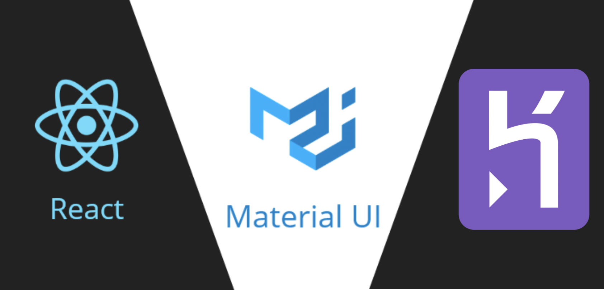

<h1 align="center">1.4 Task Planner Project - Front End - Part 2</h1>

## Heroku Deploy
[Url heroku app](https://ieti-lab03.herokuapp.com/)

React project using Material-UI library.

## Running instructions 

 * Install npm the last version (currently 6.9.0)
 * Clone the repository 
    https://github.com/QSARJP/IETI-LAB03.git
    and go to the folder IETI-LAB1.
 * Type in the command prompt
    * npm i 
    * npm start 

### Usuario de prueba

* Email : juan@mail.com

* Password : 123

## Author 

Juan Pablo Ospina Henao 
